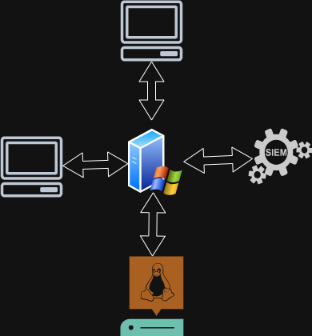

# Active Directory Lab Environment

## Purpose
This lab simulates a small enterprise Active Directory environment to practice
security monitoring, log analysis, and incident investigation.

## Architecture
- 1x Windows Server (2022)
- 2x Windows 10/11 client machines
- 1x Linux server
- Centralised logging via SIEM

## Domain Details
- Domain name: lab.local
- Domain Controller: DC001
- User accounts:
  - standard-user1
  - standard-user2
  - admin-user

## Security Goals
- Monitor authentication activity
- Detect abnormal login behaviour
- Track privilege changes
- Establish a baseline of normal activity
  
## Architecture Diagram

